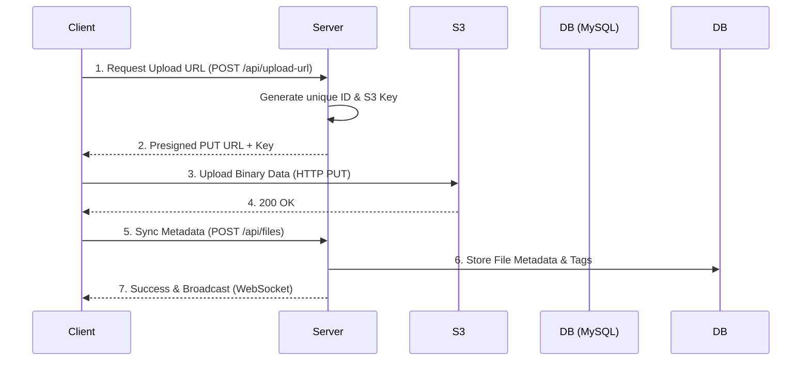

# ☁️ Mono S3

Mono S3 is a professional-grade, full-stack file management platform optimized for S3-compatible storage. It bridges the gap between raw object storage and user-friendly file management, offering secure sharing, versioning, and real-time collaboration.

---

## 🏗️ Architecture & Flow

Mono S3 utilizes a **Direct-to-S3** architecture. This design ensures that large file uploads do not bottleneck the Node.js server, as clients stream data directly to S3 using temporary presigned URLs.

### Upload Flow Diagram


---

## ✨ Key Features

- **🔐 Enterprise-Grade Security**:
  - **Private Files**: Restrict access to owners only.
  - **PIN Protection**: Share files securely with a 4-digit PIN requirement.
  - **Auto-Expiration**: Set links to expire after a specific timestamp.
  - **Download Limits**: Control global and **Per-User** access counts.
- **📤 High-Performance Batch Upload**: Select and upload multiple files simultaneously with aggregate progress tracking.
- **👁️ Advanced In-App Previews**: 
  - **Code Highlighting**: View source code for `.js`, `.ts`, `.json`, `.sql`, etc.
  - **PDF Viewer**: Embedded document rendering.
  - **Enhanced Media**: Premium Audio/Video players with micro-animations.
- **📜 File Versioning**: Maintain a history of file changes with parent-child relationship tracking.
- **🏷️ Smart Organization**: Dynamic tagging and categorization (Games, Videos, Documents).
- **⚡ Real-time Dashboard**: Live updates for file events via WebSockets and visual analytics using Recharts.

---

## 🛠️ Tech Stack

### Frontend
- **React 19** with **Vite**
- **Tailwind CSS 4** & **Framer Motion**
- **Radix UI** primitives
- **TanStack Query** for server state management
- **Wouter** for lightweight routing

### Backend
- **Express 5** (Node.js)
- **Drizzle ORM** with **MySQL**
- **Passport.js** (Local Auth)
- **AWS SDK V3** (S3 Storage)
- **WS (WebSockets)** for real-time signaling

---

## 🚀 Getting Started

### 1. Environment Configuration
Create a `.env` file in the root directory:

```env
# Database
DATABASE_HOST=your_host
DATABASE_PORT=3306
DATABASE_USER=your_user
DATABASE_PASSWORD=your_password
DATABASE_NAME=your_db

# S3 Storage
S3_REGION=us-east-1
S3_ACCESS_KEY_ID=your_access_key
S3_SECRET_ACCESS_KEY=your_secret_key
S3_BUCKET_NAME=your_bucket
# Optional: S3_ENDPOINT=https://... (for MinIO/LocalStack)

# App
PORT=5000
NODE_ENV=development
SESSION_SECRET=a_strong_random_secret
```

### 2. Installation
```bash
npm install
```

### 3. Database Migration
```bash
npm run db:push
```

### 4. Run the Application
```bash
# Development (Client & Server)
npm run dev

# Production Build
npm run build
npm start
```

---

## 📂 Project Structure

- `client/` - React frontend application.
- `server/` - Express backend, S3 integration, and WebSocket logic.
- `shared/` - Drizzle schema and Zod validation common to both client and server.
- `migrations/` - Database schema snapshots.

---

*Built with ❤️ for efficient cloud storage management.*
